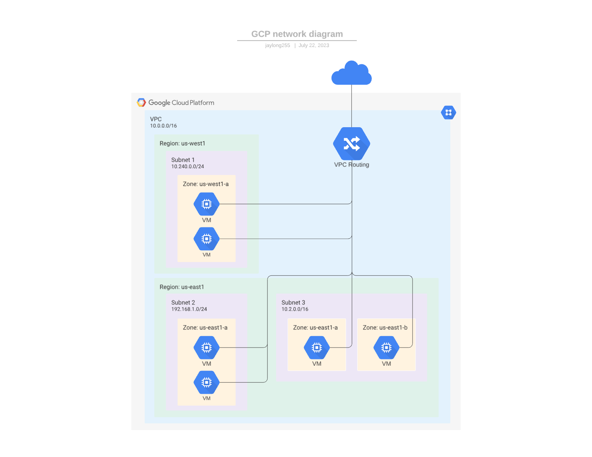
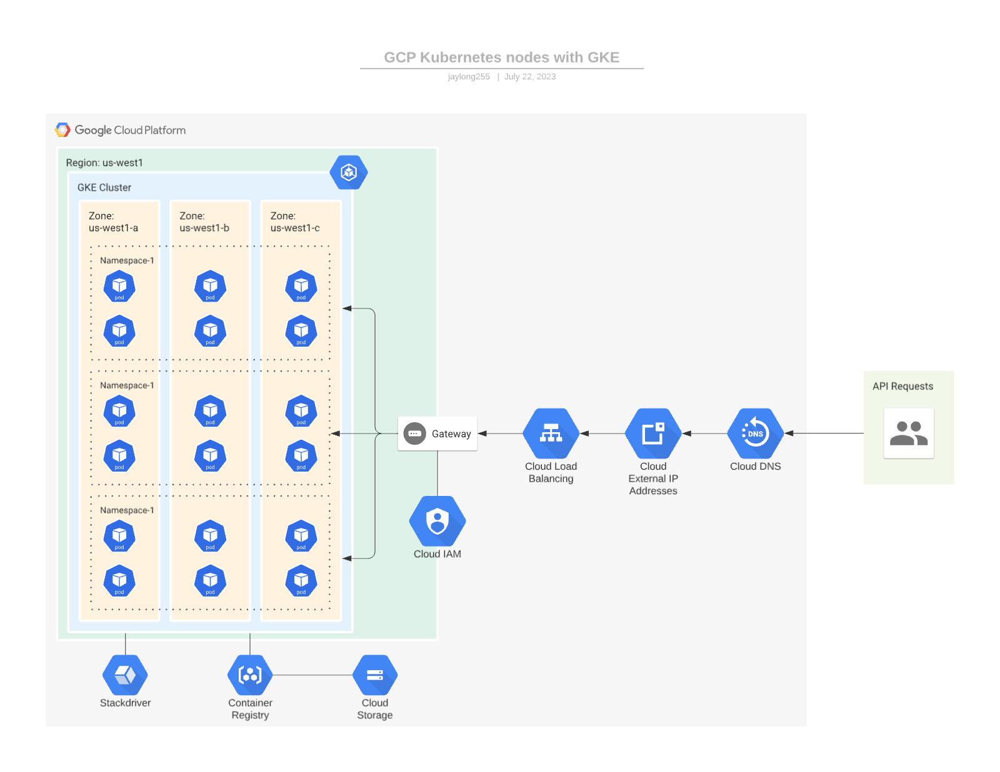

# Mastodon IaC

Infrastructure, documentation and examples on how to deploy an instance of Mastodon

## Useful Links

### Random Examples

[How to Boost Mastodon Server Performance with Redis](https://thenewstack.io/how-to-boost-mastodon-server-performance-with-redis/)


### Examples with Terraform

[Deploy a Mastodon instance - Example with Terraform and AWS](https://medium.com/@aureliendemilly/deploy-a-mastodon-instance-aec81d17f18a)

This one is a few years old. Try to find a reason to ignore it but if you get desperate, I'm sure it has some useful ideas and information that are still relevant.

[The GitHub Repo for the TF Module Used in the Above Blog](https://github.com/ademilly/mastodon-aws-terraform)

Again, no one has contributed to this in 6 years. So either not much has changed or everyone is using a different module now.

[GitHub Repo for GCP/Terraform](https://github.com/bocan/mastodon-google-cloud)

This one may be GOLD. I'm about to try and launch it on my own account. 

---

## Folder and Project Structure
The trick here is to organize projects into folders that allow us to have a highly privileged Terraform agent across all projects managed by IaC, while keeping it from being able to self-escalate its own permissions beyond its sandbox and thus throughout the entire GCP account.

```bash
# Folder / Project Structure and Service Accounts

📁 Terraform-Managed-Resources (Folder)
├── 📁 Terraform-Managed-Projects (Folder)
│   ├── 📁 My-App (Folder)
│   │   └── 🚀 My-App (Project)
│   │   │   ├── 👤 Resource1 (Service Account)
│   │   │   └── 👤 Resource2 (Service Account)
│   └── 📁 My-App-Dev (Folder)
│   │   ├── 🚀 My-App-Staging (Project)
│   │   │   └── 👤 Resource1 (Service Account)
│   │   ├── 🚀 My-App-PR-456 (Project)
│   │   │   └── 👤 Resource1 (Service Account)
│   │   └── 🚀 My-App-PR-123 (Project)
│   │   │   └── 👤 Resource1 (Service Account)
│   ├── 📁 Some-Other-App (Folder)
│   │   └── 🚀 Some-Other-App (Project)
│   │   │   └── 👤 Resource1 (Service Account)
│   └── 📁 My-App-Dev (Folder)
│       ├── 🚀 Some-Other-App-Staging (Project)
│       │   └── 👤 Resource1 (Service Account)
│       └── 🚀 Some-Other-App-PR-678 (Project)
│           └── 👤 Resource1 (Service Account)
└── 🚀 Terraform-Agents
    └── 👤 Terraform (Service Account)
```


## Network

The following module is a versitile and popular solution in the Terraform community for launching network infrastructure on GCP.

`terraform-google-modules/network/google`

[Terraform Network Module](https://registry.terraform.io/modules/terraform-google-modules/network/google/latest)



### NAT IP

### Cloud Router

### Cloud NAT

## Firewalls

### Firewall IAP

## Service Accounts

### Monitoring and Backups

### Workload Identity User

### Monitoring Bucket

### Storage Bucket

### Keyring

## Kubernetes



### 

