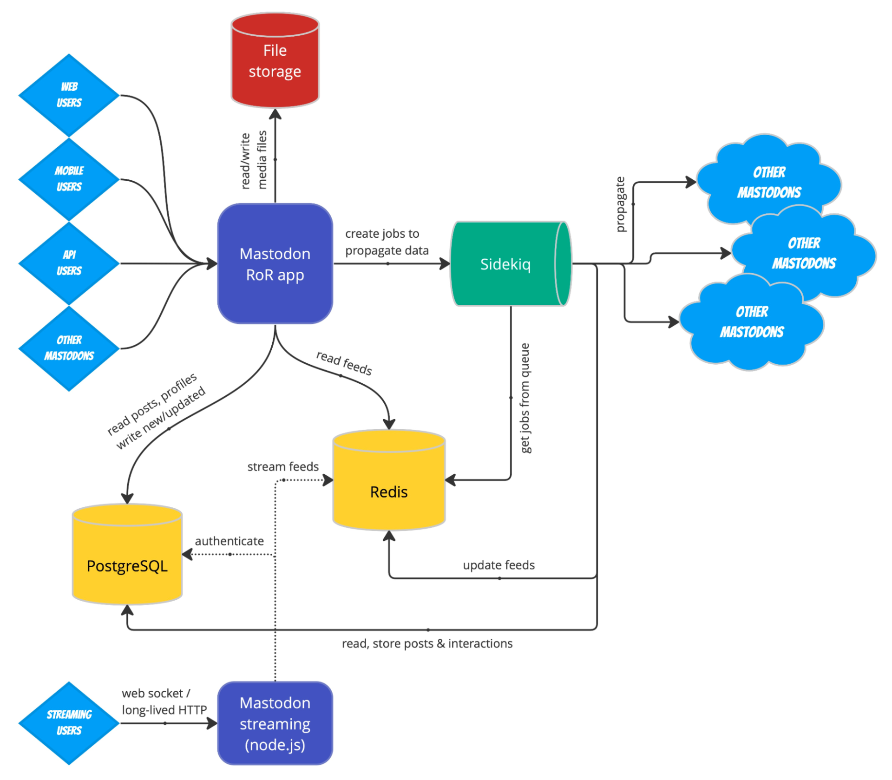

# Mastodon IaC

Infrastructure, documentation and examples on how to deploy an instance of Mastodon

## Useful Links

### Random Examples

[How to Boost Mastodon Server Performance with Redis](https://thenewstack.io/how-to-boost-mastodon-server-performance-with-redis/)

### Examples with Terraform

[Deploy a Mastodon instance - Example with Terraform and AWS](https://medium.com/@aureliendemilly/deploy-a-mastodon-instance-aec81d17f18a)

This one is a few years old. Try to find a reason to ignore it but if you get desperate, I'm sure it has some useful ideas and information that are still relevant.

[The GitHub Repo for the TF Module Used in the Above Blog](https://github.com/ademilly/mastodon-aws-terraform)

Again, no one has contributed to this in 6 years. So either not much has changed or everyone is using a different module now.

[GitHub Repo for GCP/Terraform](https://github.com/bocan/mastodon-google-cloud)

This one may be GOLD. I'm about to try and launch it on my own account. 

